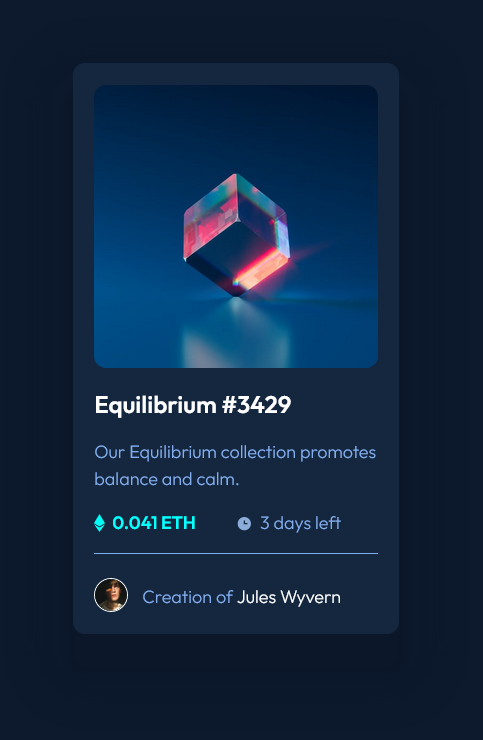

## Overview
This a coding challenge from Front End Mentor. It is a simple NFT card that has a hover effect/

### The challenge

Users should be able to:

- View the optimal layout depending on their device's screen size
- See hover states for interactive elements

### Screenshot

### Links

- Solution URL: [Add solution URL here](https://your-solution-url.com)
- Live Site URL: [Add live site URL here](https://your-live-site-url.com)

## My process
I opened the images on Photoshop to get the hex values of the colored used in the design. I do not have the Figma file so I had to estimate the sizes of the design elements.

### Built with
- Semantic HTML5 markup
- CSS custom properties
- Flexbox
- Mobile-first workflow

### What I learned
I didn't actively developed sites for a while and it was the first time I used multiple drop shadows to get that subtle shapes behind the card itself. Thanks to W3 School for its tutorial regarding this.

### Continued development
Next up is to create my own grid using flexbox.

### Useful resource

Box Shadows and Multiple Shadows
https://www.w3schools.com/cssref/css3_pr_box-shadow.asp

## Author
Arnold Rubi 

- Website - [Arnold Rubi](https://arnoldrubi.com/)
- Frontend Mentor - [@arnoldrubi](https://www.frontendmentor.io/profile/arnoldrubi)
- Twitter - [@boygie17](https://twitter.com/boygie17)